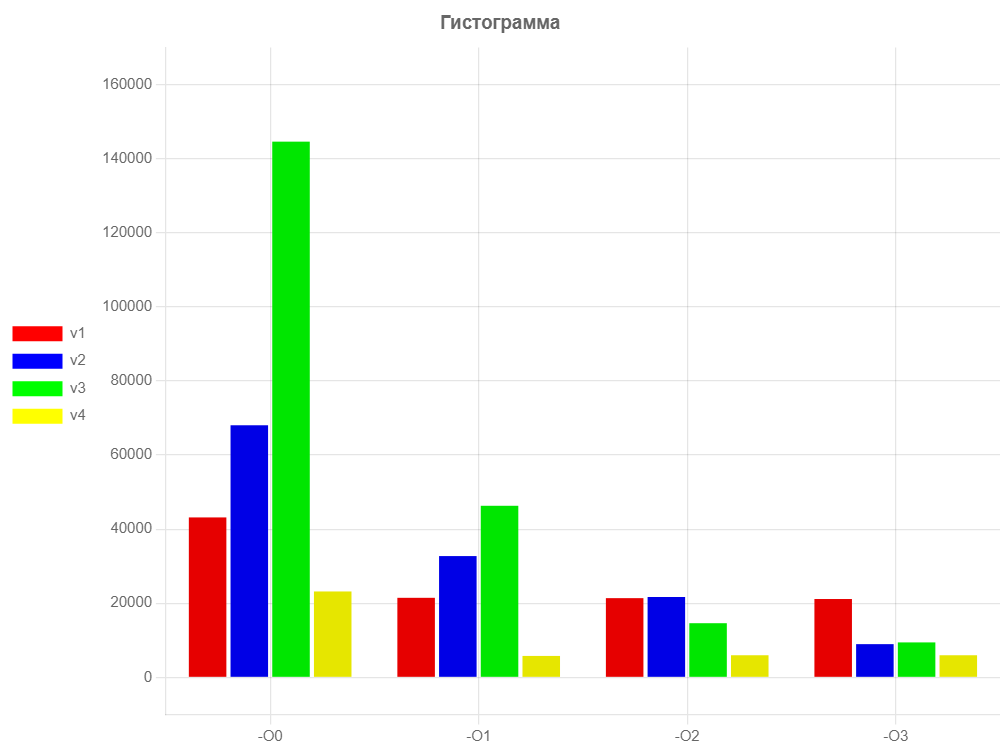

# Оптимизация работы программы на языке C с помощью векторных мультимедийных инструкций SIMD / AVX (Advanced Vector eXtensions)

### _Исследование проводилось на примере ускорения расчета фрактала "Множество Мандельброта"_

## Содержание

1. [Аннотация](#аннотация)
2. [Графическое управление](#графическое-управление)
3. [Теоретические сведения](#теоретические-сведения)
    - [Множество Мандельброта](#множество-мандельброта)
    - [AVX инструкции](#avx-инструкции)
4. [Немного об отрисовки множества Мандельброта](немного-об-отрисовки-множества-мандельброта)
5. [Методика измерений](#методика-измерений)
6. [Используемое оборудование](#используемое-оборудование)
7. [Реализация](#реализация)
    - [Первая версия программы (примитивная)](#первая-версия-программы)
    - [Вторая версия программы (на массиве)](#вторая-версия-программы)
    - [Третья версия программы (свои интринсики)](#третья-версия-программы)
    - [Четвертая версия программы (SIMD инструкции)](#четвертая-версия-программы)
8. [Результаты измерений и обработка данных](#результаты-измерений-и-обработка-данных)
9. [Расчет погрешностей](#расчет-погрешностей)
10. [Выводы](#выводы)


## Аннотация
В работе измеряется ускорение времени исполнения кода при использовании SIMD инструкций. Измерение проводятся на программах с 4 разными версиями ускорения, а также с использованием флагов оптимизации компилятора -O2 и -O3.

## Графическое управление
| Клавиша           |     Действие                         |
|-------------------|--------------------------------------|
| стрелка вверх     |Сдвиг вверх                           |
| стрелка вниз      |Сдвиг вниз                            |
| стрелка влево     |Сдвиг влево                           |
| стрелка вправо    |Сдвиг вправо                          |
|   Z               |Увеличение изображения                |
|   A               |Уменьшение изображения                |
|  shift            |Увеличение скорости перемещения       |
|   +               |Увеличение содержания цвета           |
|   -               |Уменьшение содержания цвета           |
|   R               |Изменение красного цвета              |
|   G               |Изменение зеленого цвета              |
|   B               |Изменение синего цвета                |


## Теоретические сведения
### Множество Мандельброта
Множество Мандельброта - фрактал, множество точек на комплексной плоскости, для которых задано рекуррентное соотношение z_(n+1) = z_n 2 + z_0. Классический способ раскраски предполагает: множество точек, для которых существует действительное R, такое что для любых натуральных n выполняется |z_n|< R.
В работе координаты плоскости (x, y) рассчитываются по следующей формуле. x = x 2 + y 2 + x_0, y = 2xy + y_0. Для ускорения вычислений x 2, y 2 рассчитываются один раз.

### AVX инструкции
Разрешение AVX (Advanced Vector eXtensions – усовершенствованные векторные расширения) - мультимедийные инструкции, ориентированные на параллельное выполнение нескольких операций в режиме SIMD (Single-Instruction, Multiple-Data - одиночный поток команд, множественный поток данных) и на работу со скалярными данными с плавающей точкой. Изначально avx инструкции были созданы для обработки графики и изображений. Сейчас с их помощью производится поддержка операций с плавающей точкой в архитектуре x86-64.

## Немного об отрисовки множества Мандельброта (раскраски)
Цвет пикселей зависит от количества итераций подсчета координат для каждой точки z_0. Цвет задается в режиме RGB. По горячим клавишам можно изменять цвет изображения.

## Методика измерений
Подсчет количества итераций для каждой координаты производится 10 раз, после чего берется среднее время работы программы. Также считается дисперсия.

## Используемое оборудование
Процессор: 12th Gen Intel(R) Core(TM) i7-1255U  1.70 GHz
Оперативная память: 16,0 ГБ
ОС: Windows 10
Компилятор: g++.exe (GCC) 4.8.1
Уровни оптимизации: O0, O1, O2, O3
Полный список флагов: -msse3 -Wshadow -Winit-self -Wredundant-decls -Wcast-align -Wundef -Wfloat-equal -Winline -Wunreachable-code -Wmissing-declarations -Wmissing-include-dirs -Wswitch-enum -Wswitch-default -Weffc++ -Wmain -Wextra -Wall -g -pipe -fexceptions -Wcast-qual -Wconversion -Wctor-dtor-privacy -Wempty-body -Wformat-security -Wformat=2 -Wignored-qualifiers -Wlogical-op -Wno-missing-field-initializers -Wnon-virtual-dtor -Woverloaded-virtual -Wpointer-arith -Wsign-promo -Wstack-usage=8192 -Wstrict-aliasing -Wstrict-null-sentinel -Wtype-limits -Wwrite-strings -Werror=vla -D_DEBUG -D_EJUDGE_CLIENT_SIDE

## Реализация
### Первая версия программы (примитивная)
Каждая координата считается отдельно.
```
float x_2 = x * x;
float y_2 = y * y;
float xy  = x * y;
float r_2 = x_2 + y_2;

if (r_2 >= radiusMax_2) return i;
```
### Вторая версия программы (на массиве)
Все операции проводятся для массива из 4 чисел с помощью for
```
for (int j = 0; j < nCounts; j++) x_2[j] = x[j] * x[j];
for (int j = 0; j < nCounts; j++) y_2[j] = y[j] * y[j];
for (int j = 0; j < nCounts; j++) xy [j] = x[j] * y[j];
for (int j = 0; j < nCounts; j++) r_2[j] = x_2[j] + y_2[j];

for (int j = 0; j < nCounts; j++)
{
    if (mask & (1 << j) && r_2[j] >= radiusMax_2)
    {
        n[j]  = i;
        mask &= ~(1 << j);
    }
}
```
### Третья версия программы (свои интринсики)
Также есть массив,  операции с ним выполняются с помощью inline функций
```
inline void mm_add_ps  (float mm[4], const float mm1[4], const float mm2[4])
{
    for (int i = 0; i < 4; i++) mm[i] = mm1[i] + mm2[i];
}
inline void mm_mul_ps  (float mm[4], const float mm1[4], const float mm2[4])
{
    for (int i = 0; i < 4; i++) mm[i] = mm1[i] * mm2[i];
}
...
mm_mul_ps (x_2, x, x);
mm_mul_ps (y_2, y, y);
mm_mul_ps (xy,  x, y);
mm_add_ps (r_2, x_2, y_2);

float cmp[4] = { 0 };
mm_cmple_ps (cmp, r_2, r_2Max);
mask = mm_movemask_ps (cmp);
if (mask == 0) return nIterations;
```

### Четвертая версия программы (SIMD инструкции)
Использование SIMD инструкций
```
__m128 x_2 = _mm_mul_ps (x, x);
__m128 y_2 = _mm_mul_ps (y, y);
__m128 xy  = _mm_mul_ps (x, y);
__m128 r_2 = _mm_add_ps (x_2, y_2);

__m128 cmp = _mm_cmple_ps (r_2, _mm_set_ps1 (radiusMax_2));
nIterations = _mm_sub_epi32 (nIterations, _mm_castps_si128 (cmp));

int mask = _mm_movemask_ps (cmp);
if (mask == 0) return nIterations;
```

## Результаты измерений и обработка данных
Измерение производились с помощью функции __rdtsc. Данные измерений представлены в таблице:
Тактов процессора:
| | -O0 | -O1 | -O2 | -O3 |
| --- | --- | --- | --- | --- |
| v1, 1e4 cycles |43185 +- 529 | 21489 +- 583 | 21399 +- 26 | 21166 +- 64 |
| v2, 1e4 cycles |68054 +- 131 | 32754 +- 124 | 21709 +- 168 | 8986 +- 23 |
| v3, 1e4 cycles |144593 +- 1013 | 46325 +- 158 | 14637 +- 27 | 9456 +- 25 |
| v4, 1e4 cycles |23204 +- 225 | 5804 +- 17 | 5990 +- 18 | 5988 +- 16 |

Список всех измерений можно посмотреть в папке tests

## Расчет погрешностей
Я посчитала дисперсию по следующему алгоритму:
```
unsigned long long* data          = ReadData (nTest);
unsigned long long  meanData      = SUM (data[i]) / nCycle;
unsigned long long* deviation     = (data[i] - meanData) ^ 2;
unsigned long long  meanDeviation = SUM (deviation[i]) / nCycle;
unsigned long long  meanSigma     = sqrt (meanDeviation);
```
Дисперсия:
| | -O0 | -O1 | -O2 | -O3 |
| --- | --- | --- | --- | --- |
| v1, 1e4 cycles |529| 583 | 26 | 64 |
| v2, 1e4 cycles |131| 124 | 168 | 23 |
| v3, 1e4 cycles |1013| 158 | 27 | 25 |
| v4, 1e4 cycles |225| 17 | 18 | 16 |


## Выводы
Программа ускорилась в ~3.5 раз. Интринсики топ!!!
